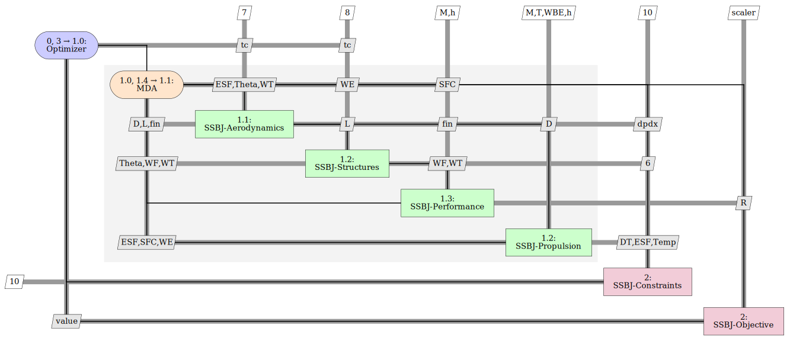

# mdax-ssbj

This repository encapsulates the [SSBJ test case](http://ntrs.nasa.gov/archive/nasa/casi.ntrs.nasa.gov/19980234657.pdf).
It uses the [SSBJ KADMOS repository](https://bitbucket.org/imcovangent/ssbjkadmos/src/master/), adds tool I/O definitions, and makes the tools ready for integration in RCE. 

## Installation

To install, use [Anaconda](https://www.anaconda.com/products/individual). 

Open the Anaconda prompt, navigate to the directory and run the following command for creating a virtual environment with installed dependencies.
```
conda env create -f environment.yml
```
This repo uses ssbj-kadmos to run the tools. Switch into the newly created environment using 
```
conda activate ssbj
```
and install ssbj-kadmos using 
```
pip install ssbjkadmos
```
Once you set up your Python environment, you can integrate the tools in RCE. Follow the descriptions in 
the [docs](./doc/rce-tool-integration.pdf).

To get an impression of the tools in a generated workflow, see [examples](./example/html).

For comments or feedback contact us at [andreas.pagerisueno@dlr.de](mailto:andreas.pagerisueno@dlr.de).


